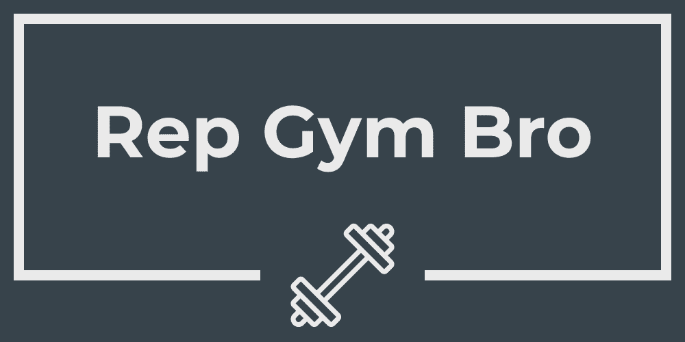

# NewHacks-RGB

## Inspiration
Tracking workouts at the gym is annoying, so we wanted to develop an app to keep track of it for you.

## What it does
It takes video of your workout and keeps track of how many reps you've done of a specific workout.

## How we built it
We used ReactJS for the front-end and Python with OpenCV, MediaPipe, and Numpy.

## Challenges we ran into
We struggled to integrate the Python backend with the JavaScript frontend.

## Accomplishments that we're proud of
- We put a lot of effort into it

## What we learned
- React

## What's next for RGB
- Integrate backend and frontend
- Live video